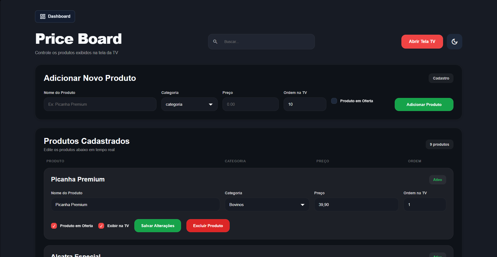
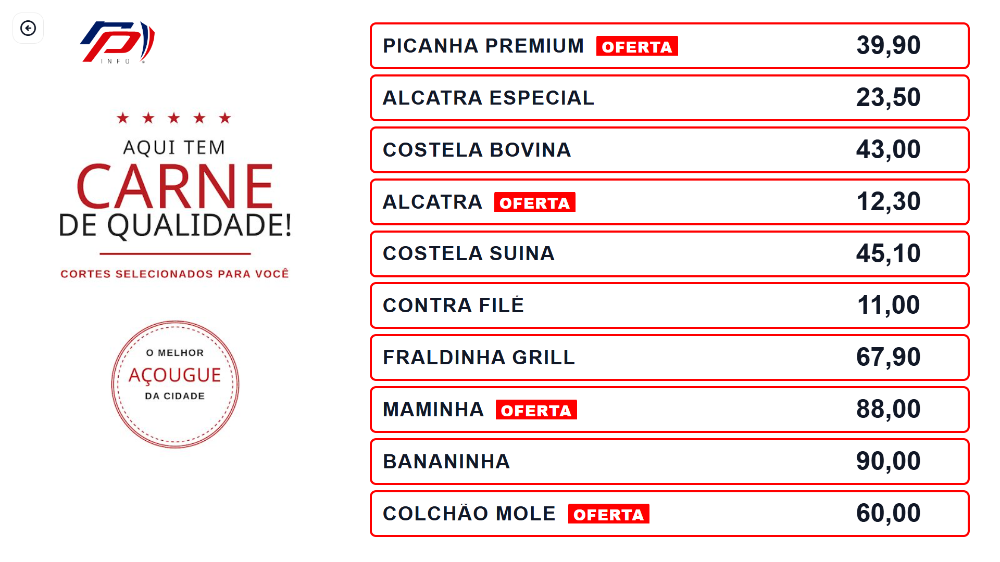
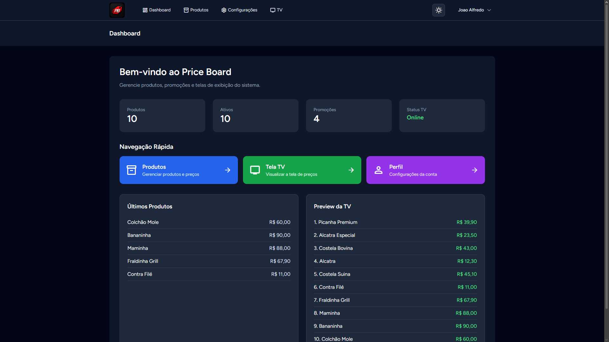
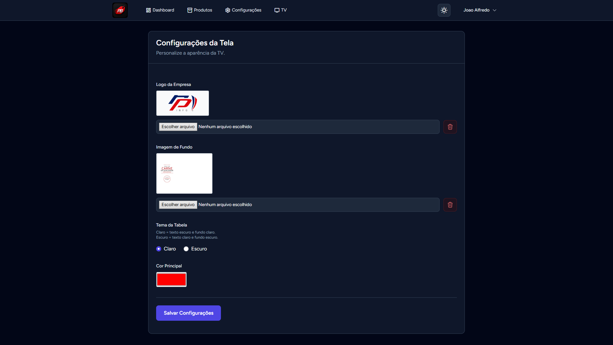

# 🥩 Price Board

Sistema desenvolvido em **Laravel 12** para exibição de preços em televisores/monitores e gerenciamento dos produtos através de um painel administrativo.

O objetivo é permitir que mercados, açougues e estabelecimentos similares atualizem os preços em tempo real sem necessidade de alterar manualmente a arte exibida na TV.

---

## ✨ Funcionalidades

- 📺 Tela pública para exibição dos produtos
- 🛠️ Painel administrativo protegido por autenticação
- ➕ Cadastro de produtos
- ✏️ Edição de produtos
- 🗑️ Exclusão de produtos
- 🔍 Pesquisa de produtos
- 📂 Organização por categorias
- 💲 Controle de preços
- 🏷️ Destaque para produtos em promoção
- 👁️ Controle de produtos ativos/inativos
- 🔢 Ordenação personalizada
- ⚙️ Configurações do sistema

---

## 📷 Telas

### Painel Administrativo

> Gerenciamento completo dos produtos.



---

### Tela da TV

> Interface otimizada para televisores e monitores.



---

### Dashboard

> Dashboard limpa e prática.



---

### Forms

> Formulario de configuracão da tela.



---

## 🚀 Tecnologias

- PHP 8.2+
- Laravel 12
- Livewire
- Jetstream
- Laravel Sanctum
- MySQL
- HTML5
- CSS3
- JavaScript
- Vite

---

## 📁 Estrutura do Projeto

```
app/
database/
public/
resources/
routes/
storage/
```

---

## ⚙️ Instalação

Clone o projeto

```bash
git clone https://github.com/Juaokkkk/Price-Board.git
```

Entre na pasta

```bash
cd Price-Board
```

Instale as dependências

```bash
composer install

npm install
```

Configure o arquivo `.env`

```bash
cp .env.example .env
```

Gere a chave

```bash
php artisan key:generate
```

Configure seu banco de dados no arquivo `.env`.

Execute as migrations

```bash
php artisan migrate
```

Inicie o projeto

```bash
php artisan serve
```

Em outro terminal

```bash
npm run dev
```

---

## 🔐 Acesso

Após realizar o login, estarão disponíveis as seguintes áreas:

| Rota | Descrição |
|------|-----------|
| `/admin/produtos` | Administração dos produtos |
| `/admin/configuracoes` | Configurações do sistema |
| `/tv/acougue` | Tela pública da TV |

---

## 📌 Funcionalidades do Produto

Cada produto possui:

- Nome
- Categoria
- Preço
- Imagem
- Ordem de exibição
- Promoção
- Status (Ativo/Inativo)

---

## 🎯 Objetivo

O projeto foi criado para facilitar a atualização de painéis eletrônicos de preços, eliminando a necessidade de recriar artes sempre que houver alteração nos valores dos produtos.

---

## 📈 Melhorias Futuras

- [ ] Upload de imagens por categoria
- [ ] Múltiplas telas
- [ ] Agendamento de promoções
- [ ] Histórico de alterações
- [ ] API para integração com ERP
- [ ] Atualização em tempo real utilizando WebSockets

---

## 👨‍💻 Autor

**João Alfredo**

GitHub:
https://github.com/Juaokkkk

---

## 📄 Direitos Autorais

© 2026 João Alfredo.

Todos os direitos reservados.